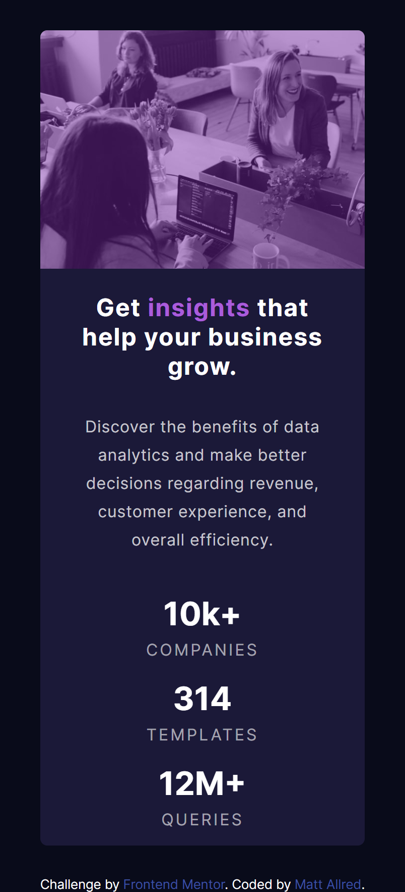

# Frontend Mentor - Stats preview card component solution

This is a solution to the [Stats preview card component challenge on Frontend Mentor](https://www.frontendmentor.io/challenges/stats-preview-card-component-8JqbgoU62). Frontend Mentor challenges help you improve your coding skills by building realistic projects. 

## Table of contents

- [Overview](#overview)
  - [The challenge](#the-challenge)
  - [Screenshot](#screenshot)
  - [Links](#links)
- [My process](#my-process)
  - [Built with](#built-with)
  - [What I learned](#what-i-learned)
  - [Continued development](#continued-development)
  - [Useful resources](#useful-resources)
- [Author](#author)
- [Acknowledgments](#acknowledgments)

## Overview

### The challenge

Users should be able to:

- View the optimal layout depending on their device's screen size

### Screenshot




### Links

- Github Repo: [https://github.com/mallred7/preview-card]
- Live Site URL: [https://allredpreviewcard.netlify.app/]

## My process

I worked on this project using the Live Server extension for VS Code to see my changes in realtime using a browser window with developer mode enabled to toggle between desktop and mobile viewing resolutions. Most work was done with a mobile resolution selected, changing to a desktop resolution just to make sure mobile styles weren't overly broken on a wider display.

### Built with

- HTML5 markup
- CSS custom properties
- Flexbox
- Mobile-first workflow

### What I learned

This challenge was a good reminder that the  tag has a display value of inline-block by default. I got pretty tripped up for longer than I care to admit making the transparent purple overlay fit over the entire image until I changed the display value to:

```css
img {
  display: block;
}
```

### Continued development

I'd like to try to focus on optimizing the time I spend working on projects. I feel like I spent 50% of my time on this project fine-tuning the final 10% of touches to the page. I'm not sure if I need to work on getting the bulk of the project up in less time at the beginning or making more prudent edits towards the end.

I'd also like to get more comfortable with Grid. I think some of the slowdowns I experienced recoding the project were caused by figuring out how to wrestle Flexbox into doing what I wanted it to do, and I think being comfortable with Grid will help me save time in the instances that it's quicker and easier to implement than a Flexbox kludge.

### Useful resources

- ["A Complete Guide to Flexbox"](https://css-tricks.com/snippets/css/a-guide-to-flexbox/) - This flexbox cheat sheet is a borderline crutch for me. Immensely helpful to the point that I struggle to commit aspects of flexbox to memory because I know I can find them here.
- [A random stackoverflow response](https://stackoverflow.com/questions/10266849/image-will-not-fill-div) - The second answer to this question (setting display to 'block') resolved an issue I was having with getting the hero image to fit the entire container it was in without leaving a small bar of space at the bottom. I set heights for everything to 100% and it didn't resolve the issue but this did. Not sure if setting the image to a block element causes any other problems but for now it works the way I want it to.

## Author

- Website - [Matt Allred](mattallred.dev)
- Frontend Mentor - [@mallred7](https://www.frontendmentor.io/profile/mallred7)

## Acknowledgments

The following is a comment on writer's block by songwriter Jason Isbell that I've taken to heart when I try to code. I think it's helped me overcome the awkwardness of putting code on the screen that I'm not 100% confident in: 

  "I do not believe in it. My job is to write, not to like what I'm writing. That's why we edit, and nobody gets editor's block".

